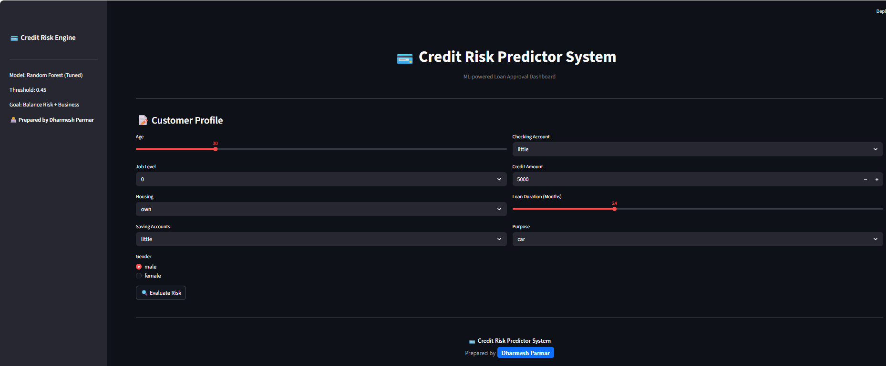

# 💳 Credit Risk Predictor System

## Overview

The **Credit Risk Predictor System** is an end-to-end Machine Learning application designed to evaluate loan applications and predict the probability of default.

This project simulates real-world banking decisions by balancing **risk detection (recall)** and **business feasibility**, ensuring high-risk customers are identified while maintaining practical loan approvals.

The system is deployed as a **Streamlit-based fintech dashboard**, enabling real-time credit risk evaluation with a clean and professional UI.

---

## Table of Contents

- [Overview](#overview)
- [App Preview](#app-preview)
- [Key Insights](#key-insights)
- [Model Performance](#model-performance)
- [Features](#features)
- [Tech Stack](#tech-stack)
- [How to Run](#how-to-run)
- [Live App](#live-app)
- [Project Structure](#project-structure)
- [Disclaimer](#disclaimer)
- [Author](#author)

---

## App Preview

---

## Key Insights

- Financial indicators like **Savings and Checking accounts** strongly influence risk  
- **Loan pressure (Credit Amount vs Duration)** is a critical factor  
- Customers with **low savings and longer durations** show higher default probability  
- Feature engineering improved both **model accuracy and interpretability**  
- Threshold tuning helped balance **risk detection vs customer approval**

---

## Model Performance

| Metric   | Value |
|----------|--------|
| Accuracy | ~64%   |
| Recall   | ~80%   |
| ROC-AUC  | ~0.67  |

### Business Interpretation

- High recall ensures most risky customers are detected  
- Slightly lower precision is acceptable to reduce financial loss  
- Model prioritizes **risk minimization over accuracy**

---

## Features

- End-to-end ML pipeline (Preprocessing + Model)
- Feature engineering (credit pressure, affordability proxy, age segmentation)
- Model comparison (Decision Tree, Random Forest, XGBoost)
- Hyperparameter tuning using GridSearchCV
- Threshold optimization for business decision-making
- Fintech-style dashboard UI
- Real-time prediction system
- KPI cards (Risk Score, Decision, Confidence)
- Business explanation layer (Key Risk Drivers)
- Clean UI with professional branding

---

## Tech Stack

- Python  
- Pandas  
- NumPy  
- Scikit-learn  
- XGBoost  
- Streamlit  
- Joblib  

---

## How to Run

Clone the repository  

Install dependencies:  
pip install -r requirements.txt  

Run the app:  
streamlit run app.py  

---

## Live App

Coming Soon

---

## Project Structure

Credit_Risk_Prediction/  

├── app.py  
├── credit_model_pipeline.pkl  
├── threshold.pkl  
├── requirements.txt  
├── README.md  

├── Images/  
│   └── app.png  

├── notebooks/  
│   └── EDA_and_Model.ipynb  

---

## Disclaimer

This project is for educational purposes only.  
It should not be used for real financial decision-making.

---

## Author

**Dharmesh Parmar**  
Machine Learning & Data Analytics Enthusiast  
